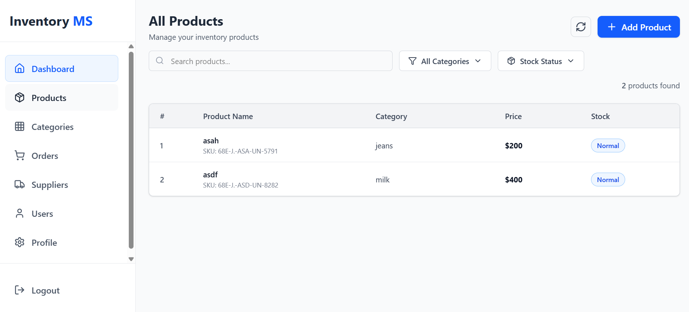

# 📦 Smart Inventory App  

A simple **Inventory Management System** built with:  
- **Frontend:** React + Vite + JavaScript + TailwindCSS  
- **Backend:** Node.js + Express + MongoDB  

This project is designed to help **small shops or businesses** manage products, categories, and stock levels.  

---


---

## ⚡ Features (Initial Version)
- Add, update, delete products  
- Organize products into categories  
- Basic authentication (Owner login)  
- Dashboard to view products and stock  

---

## 🛠️ Getting Started  

### 1️⃣ Clone the Repository
```bash
git clone https://github.com/aqeelsaeed138/SAAS-Inventary-Management-Project

## 📸 Frontend Preview
